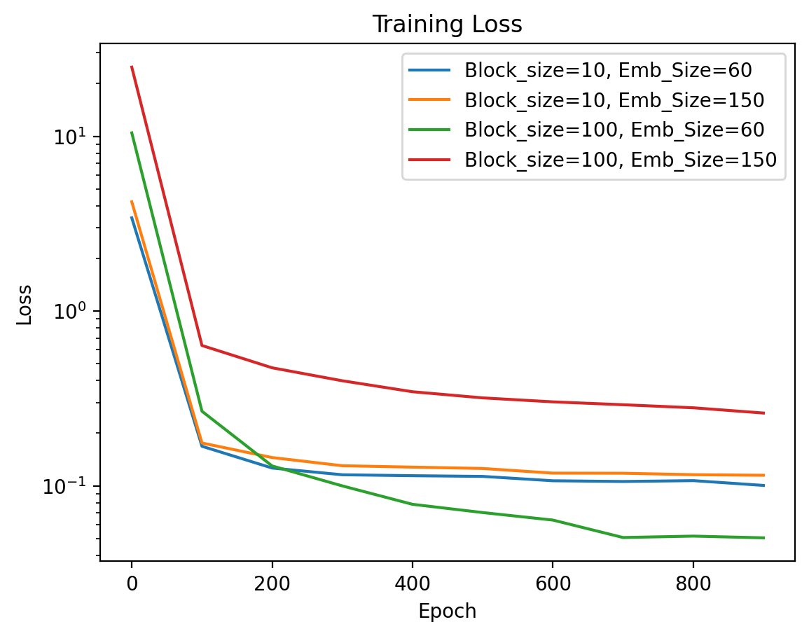

# Text-Generator-Based-on-NEXT-Character-Prediction-USING-MLP

This project, undertaken by the "Matrix Minds" group, was part of Professor Nipun Batra's machine learning course. The goal was to develop a text generation model using neural networks. Our main objective was to build and optimize a basic neural network architecture capable of predicting the next characters based on previous sequences (block size). The model's parameters, such as embedding size and block size, can be customized through the accompanying Streamlit application.

## Streamlit Application Link:-
[Text Generation Model](https://next-character-predictor-using-mlp.streamlit.app/)

## Table of Contents

- [Project Overview](#project-overview)
- [Model Architecture](#model-architecture)
- [Training process](#training-process)
- [Dependencies](#dependencies)
- [Usage](#usage)
- [Results](#results)
- [Conclusion](#conclusion)
- [Contributors](#contributors)

## Project Overview

The primary focus of this project was to implement and fine-tune a vanilla neural network architecture for text generation. The model was designed to predict subsequent characters based on preceding sequences of characters. The model's parameters are adjustable, allowing for experimentation with different embedding sizes and block sizes to achieve optimal performance.

## Model Architecture

The text generation model employs a basic neural network architecture, characterized by the following key parameters:

- **Embedding Size:** The embedding size is a crucial hyperparameter in a neural network, especially for text data. It refers to the dimensionality of the vector space in which words or characters are represented. Higher embedding sizes allow the model to capture more nuanced relationships and features of the input data. For example, an embedding size of 60 means each character is represented as a 60-dimensional vector, capturing various aspects of its meaning and context within the text. Adjusting the embedding size can significantly impact the model's ability to learn and generate coherent text.

- **Block Size:** The block size refers to the length of the input sequence that the model uses to predict the next character. It determines how much context the model considers when making predictions. For instance, a block size of 100 means the model looks at the preceding 100 characters to predict the next one. Larger block sizes provide more context, which can improve prediction accuracy, but also increase computational complexity. Finding the right balance between block size and model performance is essential for effective text generation.

The neural network architecture consists of the following layers:
1. **Embedding Layer:** The embedding layer converts the input characters into dense vectors of fixed size (embedding size). This layer helps the model learn the relationships between characters and their context within the text data.

2. **Multi-Layer-Perceptron (MLP):** The MLP layer processes the embedded input sequences and extracts relevant features to predict the next character. It consists of multiple fully connected layers with activation functions to capture complex patterns in the data.

## Training Process

The model was trained using the following steps:

1. **Data Preparation:** The text data was divided into sequences of fixed block size. Each sequence was used as input to the model, with the corresponding next character serving as the target output.

2. **Training Loop:** The model was trained over multiple epochs, with each epoch consisting of a forward pass (to calculate the predicted next character) and a backward pass (to update the model weights based on the prediction error).

3. **Loss Function:** The model's performance was measured using cross-entropy loss, which quantifies the difference between the predicted character probabilities and the actual target characters.

4. **Optimization:** The Adam optimizer was used to minimize the loss function and update the model weights iteratively.

## Dependencies

To run the project, you need to install the following dependencies:

- Python 3.7+
- NumPy
- PyTorch
- Matplotlib
- Streamlit

You can install the necessary packages using the following command:

```bash
pip install numpy torch matplotlib streamlit
```

## Usage

1. Clone the repository:

    ```bash
    git clone https://github.com/Zeenu03/Text-Generator-based-upon-next-character-prediction-from-MLP.git
    ```

2. Navigate to the project directory:

    ```bash
    cd text-generation-model
    ```

3. Run the Streamlit application:

    ```bash
    streamlit run app.py
    ```

4. Customize the model parameters (embedding size and block size) using the Streamlit interface and start generating text.

## Results

The training loss for different configurations of embedding size and block size is visualized below:



*Example of generated text with different model configurations:*

- **Model 11 (Block Size = 10, Embedding Size = 60)**
    ```
    Generated Text: two years ago i wrote about what i called "a huge, unexploited opportunity in startup founders hate most about fundraising take less time, not more. with a classic fixed size round as a legitimate, thei startups more pliable in negotiations, since they'r
    ```

- **Model 12 (Block Size = 10, Embedding Size = 150)**
    ```
    Generated Text: two years ago i wrote about what i calle will becom? mere time gives investors. the former is obviously a better predictor of success. [9] some of the randomness is concealed by the fact that investments than they were a year ago. and meanwhile the past
    ```

## Conclusion

This project successfully demonstrates the capability of a basic neural network to generate coherent text based on preceding sequences. By fine-tuning the model's parameters, we achieved notable improvements in text generation quality. Further experimentation with more advanced architectures and larger datasets could yield even better results.

## Contributors

- Matrix Minds Group
    Group Members:
    - [Bhavik](https://github.com/Bp0306)
    - [Jinil](https://github.com/Zeenu03)
    - [Pranav](https://github.com/imPranav14)
